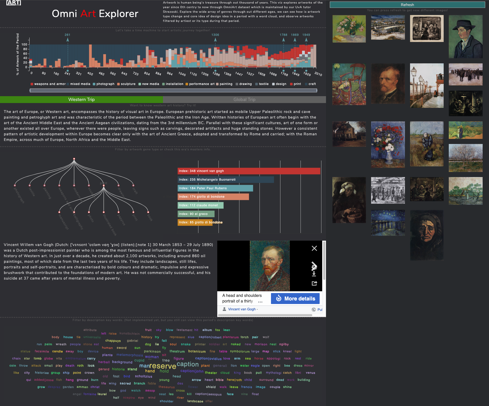

# Infomation Visualization - team 36
Project for Information Visualization


## Virtualization Report
[Project Report](Document/36_Team_Report-final.pdf)

## Usage
__Pre-requirements:__ Python3.7, Java 8
```
pip install -r requirements.txt
cd www
export FLASK_APP=app.py
flask run
```

# Database Introduction
http://isis-data.science.uva.nl/strezoski/#2

# Database dataset
http://isis-data.science.uva.nl/strezoski/omniart/omniart_v3/

## Team members
|Name       |Student ID (UvA)|Student Email|
|-----------|----------------|-------------|
|Xinran Yang|12547425        |ryanyxr@gmail.com             |
|Chuyi Tong |12663131        |c.tong@student.vu.nl             | 
|Guijing Xu |12946346        |xuguijing221@gmail.com             | 
|Futong Han |12581135        |hanfutong0804@gmail.com             | 
|Kai Zhang  |12712469        |mail@kai.sh             |


